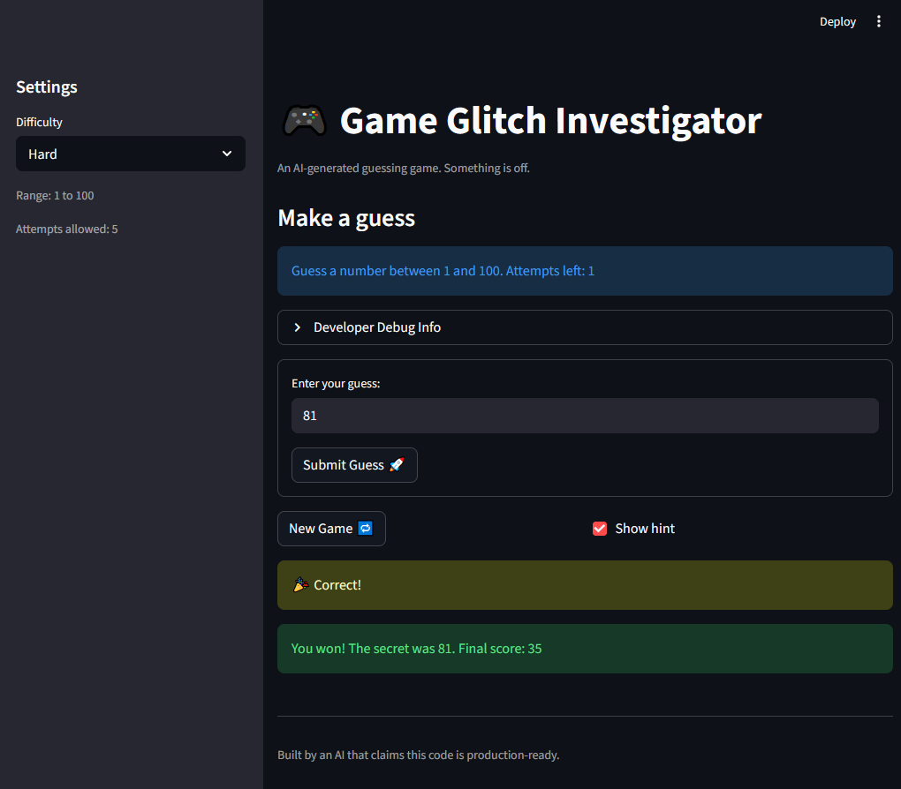

# 🎮 Game Glitch Investigator: The Impossible Guesser

## 🚨 The Situation

You asked an AI to build a simple "Number Guessing Game" using Streamlit.
It wrote the code, ran away, and now the game is unplayable. 

- You can't win.
- The hints lie to you.
- The secret number seems to have commitment issues.

## 🛠️ Setup

1. Install dependencies: `pip install -r requirements.txt`
2. Run the broken app: `python -m streamlit run app.py`

## 🕵️‍♂️ Your Mission

1. **Play the game.** Open the "Developer Debug Info" tab in the app to see the secret number. Try to win.
2. **Find the State Bug.** Why does the secret number change every time you click "Submit"? Ask ChatGPT: *"How do I keep a variable from resetting in Streamlit when I click a button?"*
3. **Fix the Logic.** The hints ("Higher/Lower") are wrong. Fix them.
4. **Refactor & Test.** - Move the logic into `logic_utils.py`.
   - Run `pytest` in your terminal.
   - Keep fixing until all tests pass!

## 📝 Document Your Experience

- [x] Describe the game's purpose.

  Game Glitch Investigator is a number guessing game where thhe player selects a difficulty level (Easy, Normal, or Hard), which sets the range of possible secret numbers and the number of allowed attempts. On each turn the player enters a guess and receives a hint directing them higher or lower. Points are awarded for winning quickly and deducted for wrong guesses. The goal is to find the secret number before running out of attempts.

- [x] Detail which bugs you found.

  1. **Swapped hint messages** — "Too High" displayed "Go HIGHER!" and "Too Low" displayed "Go LOWER!", pointing the player in the wrong direction every time.
  2. **String comparison on even attempts** — the secret was cast to a string on even-numbered attempts, causing alphabetical ordering (`"9" > "50"` is `True`) instead of numeric comparison, producing completely wrong hints.
  3. **Hint message and New Game button ignored difficulty range** — the info message always said "between 1 and 100" and New Game always called `random.randint(1, 100)`, making Easy and Normal difficulty have no effect on the secret range.
  4. **Attempts counter initialized to 1** — the counter started at 1 instead of 0, silently consuming one attempt before the player made any guess, and showing "1 attempt left" when the last attempt triggered game over.
  5. **New Game did not fully reset state** — clicking New Game changed the secret and reset attempts but left `status`, `score`, and `history` unchanged. Because `status` stayed `"won"` or `"lost"`, the game immediately called `st.stop()` on the next rerun, freezing the UI.
  6. **Wrong guess on even attempts awarded points** — `update_score` added +5 to the score for a "Too High" guess when the attempt number was even, rewarding incorrect guesses.
  7. **Attempts counter displayed stale value** — `st.info` and the debug panel rendered before the submit block incremented `attempts`, so the counter never decreased after the first guess and showed "1 attempt left" at the same time as the game-over message.

- [x] Explain what fixes you applied.

  1. Swapped the return messages in `check_guess` so "Too High" → "📉 Go LOWER!" and "Too Low" → "📈 Go HIGHER!".
  2. Removed the even/odd string-casting branch; `secret` is now always passed as an `int` to `check_guess`.
  3. Replaced the hardcoded `"between 1 and 100"` and `random.randint(1, 100)` with `{low}`, `{high}`, and `random.randint(low, high)` sourced from `get_range_for_difficulty`.
  4. Changed `st.session_state.attempts` initialization from `1` to `0`.
  5. Added `st.session_state.status = "playing"`, `st.session_state.score = 0`, and `st.session_state.history = []` to the New Game reset block.
  6. Removed the `if attempt_number % 2 == 0: return current_score + 5` branch; "Too High" now always deducts 5 points.
  7. Replaced the `st.info` and debug expander with `st.empty()` placeholders positioned at the top, filled at the bottom of the script after the submit block runs, so the displayed count always reflects the post-increment value.

## 📸 Demo

## 🚀 Stretch Features

- [ ] [If you choose to complete Challenge 4, insert a screenshot of your Enhanced Game UI here]
